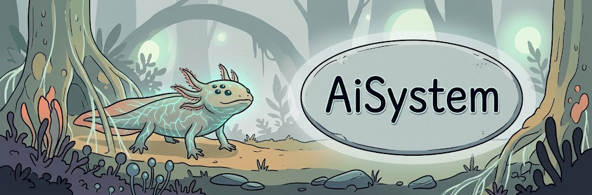
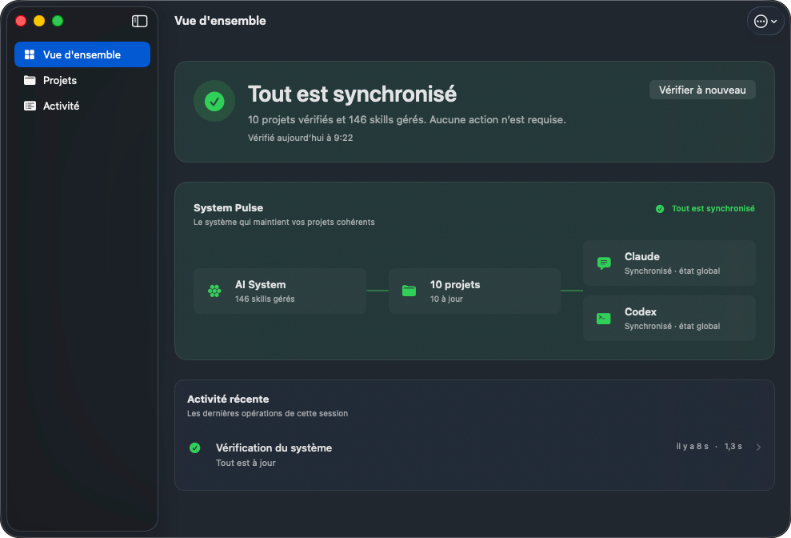

<div align="center">
  
  <h3>AI System</h3>
  <p>A local macOS control plane for keeping AI skills, rules, hooks, and generated exports consistent across projects.</p>
</div>

<p align="center">
  
</p>

## ✨ Core Features

- **Canonical skill registry**: Maintains source-of-truth artifacts in `skills/` and maps them to registered projects through `skills-registry.yml` and `skills-manifest.yml`.
- **Claude and Codex synchronization**: Generates paired exports from canonical files and prevents manual edits from hiding drift.
- **Inventory and health checks**: Detects missing exports, pairing drift, conflicts, expected exceptions, and other consistency issues with JSON and Markdown reports.
- **Project lifecycle management**: Lists and scans projects, inspects candidate folders, imports unmanaged skills, adds projects, and synchronizes exports through structured backend routes.
- **Native macOS control plane**: Provides Overview, Projects, and Activity destinations plus System Pulse, Quick Command (`⌘K`), and operation receipts.
- **Local-first execution**: Keeps business logic in Python and Bash while SwiftUI consumes versioned JSON envelopes and preserves technical logs as secondary evidence.

## 🛠️ Tech Stack

- **Platform**: macOS 26.4 or later
- **Desktop UI**: SwiftUI and AppKit
- **Language**: Swift 5.0
- **Backend**: Python 3 and Bash
- **Data and contracts**: YAML configuration, versioned JSON envelopes, Markdown reports
- **Validation**: Python `unittest`, XCTest, and `xcodebuild`
- **Build tooling**: Make and Xcode Command Line Tools
- **Runtime dependency**: PyYAML
- **Deployment**: Local macOS application installed in `~/Applications`

## 🚀 Getting Started

### Prerequisites

- macOS with [Xcode](https://developer.apple.com/xcode/) and Xcode Command Line Tools
- [Python 3](https://www.python.org/downloads/)
- [Git](https://git-scm.com/downloads)
- Bash and Make, included with the macOS developer toolchain
- Access to the project directories enabled in `skills-registry.yml` for full inventory and synchronization checks

### 1. Installation

```bash
git clone https://github.com/vincedsb1/ai-system.git
cd ai-system
python3 -m venv .venv
source .venv/bin/activate
python -m pip install --upgrade pip
python -m pip install pyyaml
```

The repository has no `package.json`; `npm install` is not part of the setup. Python scripts use the virtual environment at `.venv/bin/python` and require PyYAML.

### 2. Environment Variables

AI System has no required credentials, database URLs, or external service keys. The scripts do not automatically load dotenv files. Create `.env.local` if you want to keep the optional local execution mode in one place, then source it before running commands.

⚠️ **Important**: Never commit `.env` or `.env.local` files. They are intended for local configuration only.

```dotenv
# Optional: execution mode for scripts/ai_system_action.sh.
# Supported values: terminal (default), app, or swift.
AI_SYSTEM_UI_MODE=swift
```

```bash
source .env.local
```

The SwiftUI application sets `AI_SYSTEM_UI_MODE=swift` for its own backend calls, so this file is not required when launching the app.

### 3. Run the Development Server

AI System is a native macOS application and does not start an HTTP server. There is no `localhost` URL.

Build and install the SwiftUI application in Debug mode:

```bash
BUILD_CONFIG=Debug make build-swift-app
open "$HOME/Applications/AI System.app"
```

Run the repository checks from the terminal:

```bash
make inventory
make doctor
make check
```

## ⚙️ Configuration / Architecture

### Source-of-truth flow

1. Canonical skills live in `skills/shared/` and `skills/projects/`.
2. `skills-registry.yml` declares enabled projects, absolute roots, export targets, and project paths.
3. Synchronization scripts generate Claude and Codex exports and keep `skills-manifest.yml` aligned.
4. `scripts/ai_inventory.py` produces `reports/ai-inventory.latest.json` and `reports/ai-inventory.latest.md`.
5. `scripts/ai_doctor.py` audits the inventory and writes the corresponding Doctor reports.
6. `scripts/check_ai_system.py` combines the reports into the global validation gate used by `make check`.

### Backend and SwiftUI boundary

- `scripts/ai_system_action.sh` is the single local action entry point.
- `scripts/project_skills.py` exposes read-only project listing, scanning, and overview routes.
- `scripts/project_actions.py` exposes guarded project add, import, and sync routes.
- SwiftUI calls the shell entry point through `CommandRunner` with separate process arguments, then decodes structured JSON through `ProjectSkillsService`.
- The UI does not derive business status from human-readable stdout or log text.

### Register and synchronize a project

1. Add the project root and its paths to `skills-registry.yml`.
2. Set `enabled: true` and declare the allowed `install_shared_targets` (`codex`, `claude`, or both).
3. Inspect the registered projects and scan the target project:

   ```bash
   .venv/bin/python scripts/project_skills.py list-projects --json
   .venv/bin/python scripts/project_skills.py scan --project "<project-name>" --json
   ```

4. Synchronize generated exports for one project:

   ```bash
   make install-project PROJECT=<project-name> TARGETS=both
   ```

5. Re-run the global validation:

   ```bash
   make check
   ```

Edit canonical files and registry data only. Do not edit generated project exports by hand.

### Repository path assumptions

The current full workflow is tied to `/Users/vincentdesbrosses/Documents/Misc/ai-system` in several defaults, including `run-inventory.sh`, `scripts/ai_system_action.sh`, the Swift `AISystemPaths` service, and the registry/manifest configuration. Keep this checkout path or update those references before using the full GUI and default Make targets from another location. The registry also references other local projects; every enabled project must exist at its configured root for system-wide checks to pass.

### Validation and documentation

```bash
.venv/bin/python -m unittest discover -s tests -p 'test*.py'
xcodebuild -project "apps/AI-System/AI System.xcodeproj" -scheme "AI System" test
```

- [Operations guide](docs/OPERATIONS.md)
- [Project onboarding](docs/PROJECT-ONBOARDING.md)
- [Skill workflow](docs/SKILL-WORKFLOW.md)
- [UX3 closure report](docs/UX3-07-CLOSURE.md)

## 📄 License

No `LICENSE` file is currently present in the repository, so licensing terms are not declared. If the intended license is MIT, add the [MIT license text](https://opensource.org/license/mit/) as `LICENSE` and link it from this section.
